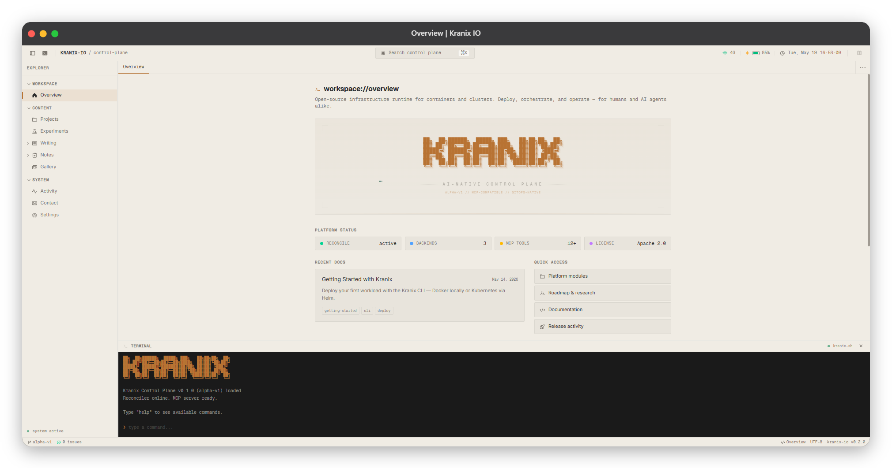

# Kranix Web

<div align="center">



</div>

Official website and developer workspace UI for [Kranix IO](https://kranix.prodevopsguytech.com) — an open-source, AI-native control plane for Docker and Kubernetes.

Built as an IDE-inspired workspace: panel navigation, explorer sidebar, integrated terminal, command palette, and MDX-powered docs — without changing the underlying UI shell from the original template.

## About Kranix IO

Kranix gives you a single interface to deploy, manage, debug, and heal container infrastructure — whether you are running a local Docker container, a `kind` cluster, or production Kubernetes.

- **MCP-compatible** — AI agents operate infrastructure through the same API as the CLI
- **GitOps-native** — `KranixApp` manifests reconciled from Git
- **Multi-backend** — Docker, Kubernetes, Podman, and remote nodes

Learn more on the main project: [github.com/kranixio](https://github.com/kranixio) · [Documentation](https://kranix.prodevopsguytech.com/writing) · [Discussions](https://github.com/kranixio/.github/discussions)

## Tech stack

| Layer | Tools |
|--------|--------|
| Framework | [Next.js](https://nextjs.org/) 16 (App Router) |
| UI | React 19, [Tailwind CSS](https://tailwindcss.com/) 4 |
| Content | [Fumadocs MDX](https://fumadocs.dev/) |
| State | [Zustand](https://zustand.docs.pmnd.rs/) |
| Motion | [Motion](https://motion.dev/) |
| Icons | [Phosphor Icons](https://phosphoricons.com/) |

## Prerequisites

- [Node.js](https://nodejs.org/) 20+
- [pnpm](https://pnpm.io/) 9+

## Getting started

```bash
# Clone the repository
git clone https://github.com/kranixio/kranix-web.git
cd kranix-web

# Install dependencies
pnpm install

# Start the development server
pnpm dev
```

Open [http://localhost:3000](http://localhost:3000) in your browser.

### Other commands

```bash
pnpm build      # Production build
pnpm start      # Serve production build
pnpm lint       # Run ESLint
pnpm lint:fix   # Auto-fix lint issues
```

## Project structure

```
kranix-web/
├── content/              # MDX content (Fumadocs)
│   ├── writing/          # Guides and documentation posts
│   └── notes/            # Architecture and internal notes
├── public/               # Static assets (fonts, favicons, OG image)
├── src/
│   ├── app/              # Next.js App Router pages and metadata
│   ├── components/
│   │   ├── panels/       # Workspace panels (overview, projects, etc.)
│   │   ├── ui/           # Shared UI primitives
│   │   └── workspace/    # Shell: toolbar, sidebar, terminal, tabs
│   ├── lib/              # Terminal commands, articles, utilities
│   └── store/            # Workspace state (Zustand)
├── source.config.ts      # Fumadocs MDX configuration
└── next.config.ts
```

## Workspace panels

| Route | Panel | Purpose |
|-------|--------|---------|
| `/overview` | Overview | Platform dashboard and quick access |
| `/projects` | Projects | Kranix modules (Core, MCP, CLI, operator, drivers) |
| `/experiments` | Experiments | Roadmap and research log |
| `/writing` | Writing | MDX documentation |
| `/notes` | Notes | Internal architecture notes |
| `/gallery` | Gallery | Architecture and platform visuals |
| `/activity` | Activity | Development activity feed |
| `/contact` | Contact | Links to docs, GitHub, discussions, CLI install |
| `/settings` | Settings | Theme and layout preferences |

### Keyboard shortcuts

| Shortcut | Action |
|----------|--------|
| `⌘K` / `Ctrl+K` | Open command palette |
| Terminal | Type `help` in the bottom panel for commands |

## Adding content

Documentation lives in `content/writing/` and notes in `content/notes/` as MDX files with frontmatter:

```mdx
---
title: My Guide
description: Short summary for SEO and cards
date: 2026-05-19
tags: ["cli", "deploy"]
category: "Guides"
---

# Page content here
```

After adding or editing MDX files, restart the dev server if new routes do not appear (Fumadocs regenerates the `.source/` types on build).

## Environment

Optional environment variables:

| Variable | Description |
|----------|-------------|
| `NEXT_PUBLIC_APP_VERSION` | Set automatically from `package.json` via `next.config.ts` |

## Deployment

The app is a standard Next.js application. Build and deploy to any host that supports Next.js (Vercel, Docker, static export if configured, etc.):

```bash
pnpm build
pnpm start
```

Update `metadataBase` in `src/app/layout.tsx` and URLs in `src/app/sitemap.ts` / `src/app/robots.ts` for your production domain.

## License

[MIT](./LICENSE) — Copyright (c) 2026 KranixIO
